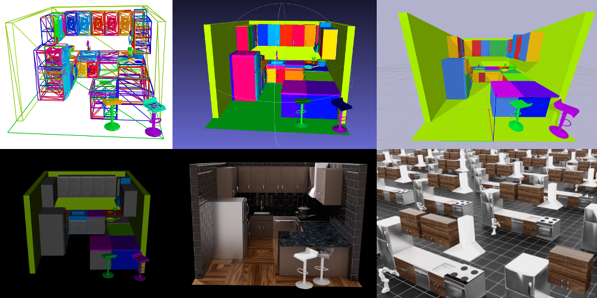

# Summary
`scene_synthesizer` is a library for writing procedural scene generators in Python with a special focus on robot manipulation. The resulting scenes can be exported to various formats, enabling physics simulation or rendering data pipelines for training robotics or vision models.

{ width=100% }

# Statement of Need
Simulation is an ever increasing data source for training deep learning models.
In robotics, simulations have been successfully used to learn behaviors such as navigation, walking, flying or manipulation.
The value of data generation in simulation mainly depends on the diversity and scale of scene layouts.
Existing datasets [@Mo_2019_CVPR; @robotix2019; @ehsani2021manipulathor; @robocasa2024] are limited in that regard, whereas purely generative models still lack the ability to create scenes that can be used in physics simulator [@schult24controlroom3d; @hoellein2023text2room].
Other procedural pipelines either focus on learning visual models [@Denninger2023; @greff2021kubric; @infinigen2023infinite], address specific use-cases such as autonomous driving [@scenic2020; @hess2021procedural], or make it hard to be extended and customized since they are tightly integrated with a particular simulation platform [@procthor].
With `scene_synthesizer` we present a library that simplifies the process of writing scene randomizers in Python, with a particular focus on physics simulations for robot manipulation. It is fully simulator-agnostic.

# Features & Functionality

`scene_synthesizer` bases its scene represenation on `trimesh` [@trimesh], enabling the use of many existing geometric algorithms.
Assets can be either loaded from file (all standard mesh formats including those representing articulations such as USD, URDF, MJCF) or instantiated from 30 different procedural objects, most of them kitchen-themed.
The placement of assets is supported by defining object-agnostic anchor points, or through automatic labelling of support surfaces and containment volumes.
Scenes can be fully articulated and six common kitchen layouts are already included.
Scene export to formats such as USD and URDF enable the use of various physic simulators.
`scene_synthesizer` has few dependencies and is easily extendable and customizable.

# Example Use Cases

We have used `scene_synthesizer` to train neural robot motion planners [@fishman2022motionpolicynetworks], neural collision checkers [@murali2023cabinet],
pick-and-place policies [@yuan2023m2t2multitaskmaskedtransformer], visuomotor policies [@dalal2023optimus], to fine-tune Vision-Language Models [@yuan2024robopointvisionlanguagemodelspatial], and in planning-based data generation pipelines [@garrett2024simpler].

# Acknowledgements

We thank Jan Czarnowski for providing code during his internship which found its way into this project.
We thank Adam Fishman, Ankur Handa, Shangru Li, Fabio Ramos, and Arsalan Mousavian for valuable feedback during the development of this project.
We thank Melanie Miulli for selecting MDL materials.

# References
